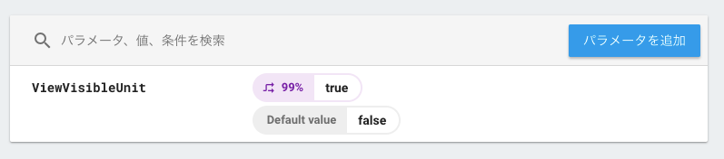

# 稀勢(Kise)

## Step: Install Kise

```
TBD
```

## Step: Unitをつくる

```java
TBD
```

## Step: fetchしてから、invoke する

```java
TBD
```

## Step: Firebaseの設定を行う

```java
package com.github.hisaichi5518.kise.example;

import android.app.Application;

import com.google.firebase.remoteconfig.FirebaseRemoteConfig;
import com.google.firebase.remoteconfig.FirebaseRemoteConfigSettings;

public class ExampleApplication extends Application {
    @Override
    public void onCreate() {
        super.onCreate();

        FirebaseRemoteConfigSettings configSettings = new FirebaseRemoteConfigSettings.Builder()
                .setDeveloperModeEnabled(BuildConfig.DEBUG)
                .build();

        FirebaseRemoteConfig.getInstance().setConfigSettings(configSettings);
        FirebaseRemoteConfig.getInstance().setDefaults(R.xml.firebase_remote_config_defaults);
    }
}
```

また、 `app/google-services.json` も必要です。詳しくは[Firebaseのドキュメント](https://firebase.google.com/docs/android/setup)を読んでください。

## Step: FirebaseRemoteConfigにて、配信したいキーと値を設定する



## Step: Finished!!!

Enjoy! :tada::tada:
サンプルコードは[example](example)以下にあります。

## 注意点:boom::boom::boom:

### Firebase Remote Config

- 値を`true` 以外を設定するとすべて `false` として扱われます
- 「変更を公開する」をサブミットしないと変更は反映されません

### Kise

- `true` の時は`customAction`を実行し、`false`の時は`defaultAction`を実行します
- `customAction`を実行した時に `Exception` が発生した場合は、 `defaultAction` を実行します
